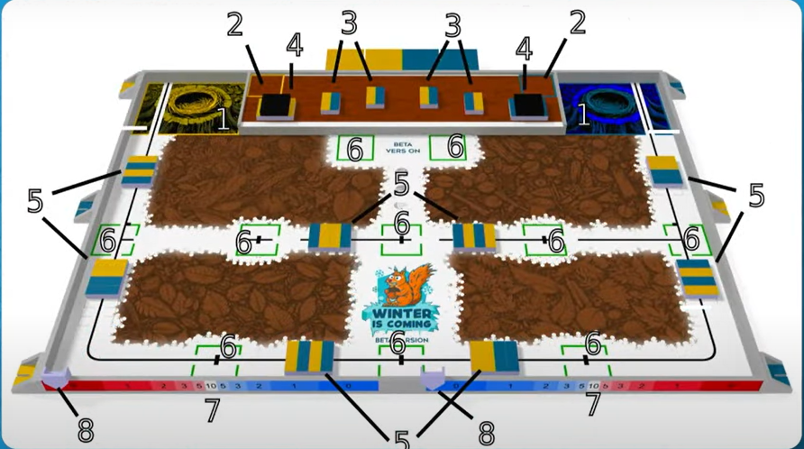
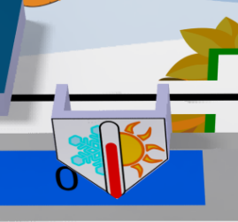
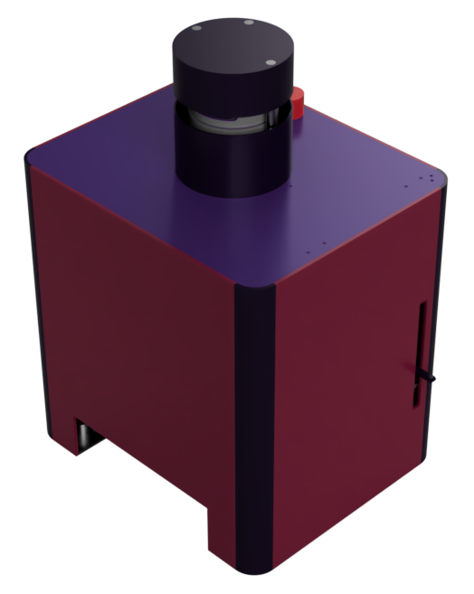
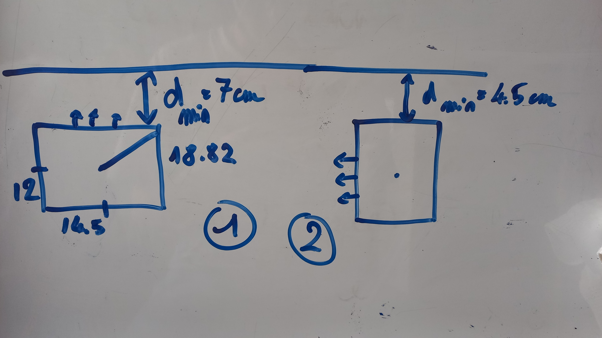
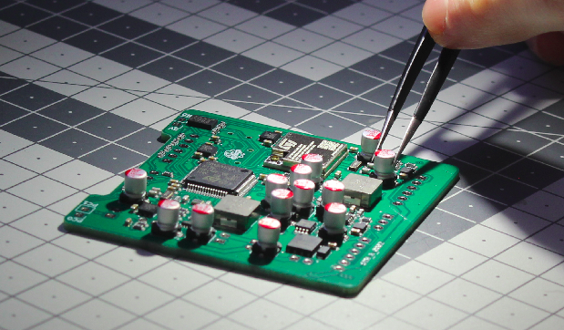

# Février 2026

Cher.e.s lecteur.trice.s, 

Bienvenue dans cette nouvelle Newsletter de CDROMS ! 

Qui dit nouvelle année, dit nouveau thème pour la Coupe de France de Robotique. Nous passons du monde des concerts à celui de l'hiver. "Winter is coming", l'édition 2026, nous propose de transformer nos robots en petits écureuils affamés, prêts à tout pour récupérer les caisses de noisettes que les humains ont ramassées avant eux. 

### CDROMS et la CDFR 2026

Après concertation avec l'équipe, nous avons choisi les actions qui nous semblaient les plus réalisables, tout en nous ramenant suffisamment de points. Dans cette newsletter, nous décrirons uniquement les actions que nous avons choisi de réaliser, avec la table de jeu suivante, table officielle de la CDFR 2026 :

 

Le robot principal partira de la zone 1, appelée le nid, pour aller vers la zone 8, où la première action a lieu : le curseur de température. À l'aide d'un bras actionné par un servo-moteur, le robot principal viendra déplacer un curseur le long de la table, où figure une échelle de température, et l'amener le plus proche des températures basses. 

 

Après avoir déplacé le curseur, il passera par les zones 5 qui le séparent du nid, emportant avec lui les caisses de noisettes qui s'y trouvent, pour les ramener dans le nid, et s'y placer à son tour. La mission du robot principal est à présent terminée.

Au tour de nos PAMIs de survivre à l'hiver, pendant les 15 dernières secondes du match : il leur faut atteindre des garde-mangers (zones 6), les occuper jusqu'à la fin du match et faire bouger un actionneur, visible depuis le public, même après la fin du match. 

Cependant, un PAMI sort du lot : le PAMI ninja. Il a le droit d'évoluer durant toute la durée du match, il est placé dans la zone 2 (en hauteur par rapport aux autres robots) et travaille en collaboration avec le ninja de l'équipe adverse. Le ninja a 2 missions : vider les frigos (zones 3), jusqu'alors remplis de caisses de noisettes, et remplir les frigos (zones 3) des caisses de noisettes vides situées en zone de chargement (zones 4). Les actions réalisées à cet endroit de la table donnent des points aux 2 équipes.

Nous pouvons à présent détailler les spécificités de nos robots et de nos systèmes pour cette année : place au côté technique !

### Robot principal et PAMI Ninja

Le robot principal et le PAMI Ninja gardent la même architecture que l'année dernière : une Raspberry Pi 4 et notre PCB plein de connecteurs pour y brancher tous les capteurs et actionneurs. Le robot principal accueille tout de même quelques modifications : les systèmes liés à la CDFR 2025 sont retirés pour y ajouter deux bras permettant de déplacer le curseur du thermomètre (un pour chaque côté) ainsi que des améliorations sur le système d'estimation de position. En plus de ces modifications fonctionnelles, le robot principal a reçu un relooking complet !

 

Concernant le PAMI Ninja, il était nécessaire de faire une petite adaptation pour que le capteur d'obstacle ne détecte pas les caisses de noisettes comme un obstacle et puisse les pousser. 

### Pas trop chaud, ni trop froid : le thermomètre

Pour déplacer le curseur sur le thermomètre représenté le long de la table, nous avons choisi de déployer un bras qui viendra se placer à l'intérieur du curseur, tandis que le robot avancera jusqu'à la zone de température froide. Pour cela, un peu de dimensionnement est nécessaire : il faut étudier l'écart entre le robot principal et le bord de la table afin de déterminer la longueur du bras. 

 

Avec ces dimensions, qui respectent les contraintes de périmètre déployé, on peut construire notre bras et le système d'accroche sur l'étage principal du robot, qui lui permettra de se déployer au moment voulu.

### PAMI Écureuils

L'année dernière, en plus du gros PAMI Superstar (devenu cette année le PAMI Ninja), nos petits PAMI étaient basés sur Arduino avec un petit composant pour contrôler les moteurs du robot. Cette année, on repart de zéro avec pour objectif d'avoir des PAMIs plus petits, plus robustes et avec plus de capacités à réaliser des actions.

Depuis le début de cette année, de nouveaux PCBs ont été désignés et un premier exemplaire a été soudé. Le PCB principal contient un microprocesseur STM32, le "cerveau" du PAMI, tandis que deux autres PCBs permettent de placer les capteurs d'obstacle et les boutons pour interagir avec le PAMI. Les premiers tests ont permis de montrer que les PCBs n'ont pas de grosses erreurs !

 Désormais, il s'agit de tester les composants qui permettront de détecter un obstacle, faire avancer le PAMI, et créer les pièces mécaniques qui constitueront le PAMI.

On vous parlera de tout ça lors de notre prochaine newsletter, qui mettra *(normalement)* moins de temps à sortir que celle-ci…

Merci de nous avoir lu jusqu'à la fin !

Les CDROMS 📀